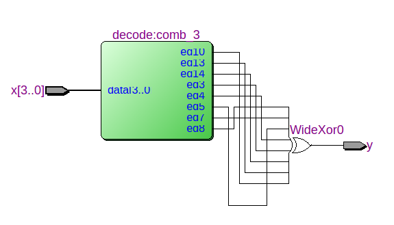

# Цель работы

Освоение маршрута проектирования цифровых комбинационных устройств в системе проектирования Quartus II и получении навыков моделирования, анализа результатов проектирования и имплементации проекта в учебную плату.


# Задание на лабораторную работу

1. Используя последовательность действий, приведенную в приложении, разработать в САПР Quartus II проекты, реализующие функцию следующими способами:
   - с использованием элементарного логического базиса;
   - на основе LPM-модуля мультиплексора (4:1) и логических элементов по схеме «мультиплексор-функция»;
   - на основе LPM-модуля дешифратора.

2.  Для каждого проекта оценить затраты на реализацию, проанализировать RTL-представление проекта, иерархию использованных примитивов, внутренних регистров и настройки LUT-таблиц, выполнить моделирование проекта.

3.  Собрать общий проект, включив в него разработанные преобразователи в качестве отдельных параллельно работающих блоков. Проанализировать RTL-представление проекта, иерархию использованных элементов; определить временные характеристики проекта с использованием анализатора Timing Analyzer.

4.  Провести имплементацию проекта в учебную плату: входные сигналы формировать на движковых переключателях, результаты работы наблюдать на светодиодных индикаторах.


# Задание

Наборы, на которых логическая функция принимает истинное значение:

3, 4, 5, 7, 8, 10, 13, 14

Таблица 1. Таблица истинности

| **X_3** | **X_2** | **X_1** | **X_0** | **Y** |
| ------- | ------- | ------- | ------- | ----- |
| 0       | 0       | 0       | 0       | 0     |
| 0       | 0       | 0       | 1       | 0     |
| 0       | 0       | 1       | 0       | 0     |
| 0       | 0       | 1       | 1       | 1     |
| 0       | 1       | 0       | 0       | 1     |
| 0       | 1       | 0       | 1       | 1     |
| 0       | 1       | 1       | 0       | 0     |
| 0       | 1       | 1       | 1       | 1     |
| 1       | 0       | 0       | 0       | 1     |
| 1       | 0       | 0       | 1       | 0     |
| 1       | 0       | 1       | 0       | 1     |
| 1       | 0       | 1       | 1       | 0     |
| 1       | 1       | 0       | 0       | 0     |
| 1       | 1       | 0       | 1       | 1     |
| 1       | 1       | 1       | 0       | 1     |
| 1       | 1       | 1       | 1       | 0     |


Таблица 2. Карта карно

|        | **00** | **01** | **11** | **10** |
| ------ | ------ | ------ | ------ | ------ |
| **00** | 0      | 0      | 1      | 0      |
| **01** | 1      | 1      | 1      | 0      |
| **11** | 0      | 1      | 0      | 1      |
| **10** | 1      | 0      | 0      | 1      |


$$
y = \neg{x_0} \neg{x_2} x_3 \lor \neg{x_1} x_2 \neg{x_3} \lor x_0 x_1 \neg{x_3} \lor x_0 \neg{x_1} x_2 \lor \neg{x_0} x_1 x_3
$$


# Выполнение работы

## Использование элементарного логического базиса


``` verilog
// 3, 4, 5, 7, 8, 10, 13, 14 
// truth table - 0001110110100110


module lab1_1 
(
    input  wire [3:0] x,
    output wire y
);

assign y = (!x[0] && !x[2] && x[3]) || (!x[1] && x[2] && !x[3]) || (x[0] && x[1] && !x[3]) || (x[0] && !x[1] && x[2]) || (!x[0] && x[1] && x[3]);

endmodule

```

Результаты анализа затрат оборудования представлены на рисунке


Задержки распространения сигнала (Slow 1200mV 0C Model)


RTL представление 


Результаты моделирования


## На основе мультиплексора (4:1) и логических элементов по схеме «мультиплексор-функция»


``` verilog
// 3, 4, 5, 7, 8, 10, 13, 14 
// truth table - 0001110110100110


module lab1_2
(
    input  wire [3:0] x,
    output wire y
);

wire [3:0] temp;

mux_ m1('b0, 'b0, 'b0, 'b1, {x[0], x[1]}, temp[0]);
mux_ m2('b1, 'b1, 'b0, 'b0, {x[0], x[1]}, temp[1]);
mux_ m3('b1, 'b0, 'b1, 'b1, {x[0], x[1]}, temp[2]);
mux_ m4('b0, 'b1, 'b1, 'b0, {x[0], x[1]}, temp[3]);

mux_ m5(temp[0], temp[1], temp[2], temp[3], {x[2], x[3]}, y);


endmodule

```

Результаты анализа затрат оборудования представлены на рисунке


Задержки распространения сигнала (Slow 1200mV 0C Model)


RTL представление 


Результаты моделирования


## На основе дешифратора

``` verilog
// 3, 4, 5, 7, 8, 10, 13, 14 
// truth table - 0001110110100110


module lab1_3
(
    input  wire [3:0] x,
    output wire y
);

wire [7:0] temp;

decode (x, temp[0], temp[1], temp[2], temp[3], temp[4], temp[5], temp[6], temp[7]);

assign y = ^temp;


endmodule

```

Результаты анализа затрат оборудования представлены на рисунке


Задержки распространения сигнала (Slow 1200mV 0C Model)


RTL представление 



Результаты моделирования


# Вывод

Освоили маршрут проектирования цифровых комбинационных устройств в системе проектирования Quartus II и получили навыки моделирования, анализа результатов проектирования и имплементации проекта в учебную плату.
