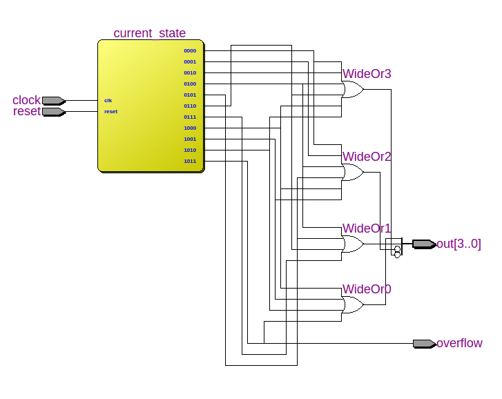

# Цель работы

Получение навыков проектирования последовательностных устройств и анализа их временных характеристик.


# Задание на лабораторную работу

Спроектировать автомат Мура в соответствии с заданием, используя следующую последовательность действий.

1. Подготовить формализованное задание функционирования автомата с использованием графа переходов. Выполнить кодирование состояний. Определить функции возбуждения элементов памяти, выполнить их минимизацию. Разработать комбинационную схему, обеспечивающей необходимые переходы.
2. Подготовить проект схемы автомата в САПР Quartus II, выполнить его моделирование, оценить затраты на реализацию, проанализировать RTL-
   представление проекта, иерархию использованных примитивов, внутренних регистров и настройки LUT-таблиц.
3. Для наблюдения смены состояний автомата на светоизлучающих диодах обеспечить в проекте понижение частоты тактового генератора. Провести имплементацию проекта в учебную плату, наблюдать работу схемы.

# Задание

Реализовать 4-разрядный суммирующий счетчик по модулю 11.

## Построение автомата: 

| S_i  | Q_3Q_2Q_1Q_0 | S_i+1 | Q_3Q_2Q_1Q_0 | D_3D_2D_1D_0 |
| :--: | :----------: | :---: | :----------: | :----------: |
|  0   |     0000     |   1   |     0001     |     0001     |
|  1   |     0001     |   2   |     0010     |     0010     |
|  2   |     0010     |   3   |     0011     |     0011     |
|  3   |     0011     |   4   |     0100     |     0100     |
|  4   |     0100     |   5   |     0101     |     0101     |
|  5   |     0101     |   6   |     0110     |     0110     |
|  6   |     0110     |   7   |     0111     |     0111     |
|  7   |     0111     |   8   |     1000     |     1000     |
|  8   |     1000     |   9   |     1001     |     1001     |
|  9   |     1001     |  10   |     1010     |     1010     |
|  10  |     1010     |  11   |     1011     |     1011     |
|  11  |     1011     |   0   |     0000     |     0000     |


## Минимизация функций перехода:


# Выполнение работы

## Реализация 1

В данной реализации реализован счетчик по модулю 11.

``` verilog
module lab2_1 (
    input wire clock,
    input wire reset,
    output wire overflow,
    output wire [3:0] out
);

reg [3:0] counter;

always @(posedge clock, posedge reset) 
begin
    if (reset)
        counter <= 4'd0;
    else
        if (counter == 4'd11)
            counter <= 4'd0;
        else
            counter <= counter + 1'd1;
end

assign out = counter;
assign overflow = (counter == 4'd11);

endmodule

```
Результаты анализа затрат оборудования представлены на рисунке


Задержки распространения сигнала (Slow 1200mV 0C Model)


RTL представление 


Результаты моделирования


### Реализация 2

В данной реализации написан трехпроцессный автомат, реализующий функции счетчика по модулю 11.

``` verilog
module lab2_2 (
    input wire clock,
    input wire reset,
    output wire overflow,
    output wire [3:0] out
);

reg [3:0] current_state, next_state;

always @(posedge clock, posedge reset) 
begin
    if (reset)
        current_state <= 4'd0;
    else
        current_state <= next_state;
end

always @(current_state)
begin
	case (current_state)
		4'b0000: next_state <= 4'b0001;
		4'b0001: next_state <= 4'b0010;
		4'b0010: next_state <= 4'b0011;
		4'b0011: next_state <= 4'b0100;
		4'b0100: next_state <= 4'b0101;
		4'b0101: next_state <= 4'b0110;
		4'b0110: next_state <= 4'b0111;
		4'b0111: next_state <= 4'b1000;
		4'b1000: next_state <= 4'b1001;
		4'b1001: next_state <= 4'b1010;
		4'b1010: next_state <= 4'b1011;
		default: next_state <= 4'b0000;
	endcase
end

assign out = current_state;
assign overflow = (current_state == 4'd11);

endmodule

```


Результаты анализа затрат оборудования представлены на рисунке


Задержки распространения сигнала (Slow 1200mV 0C Model)


RTL представление 




Результаты моделирования


## Реализация 3

В данной реализации написан трехпроцессный автомат с минимизированными функциями переходов.

``` verilog
module lab2_3 (
    input wire clock,
    input wire reset,
    output wire overflow,
    output wire [3:0] out
);

reg [3:0] current_state, next_state;

always @(posedge clock, posedge reset) 
begin
    if (reset)
        current_state <= 4'd0;
    else
        current_state <= next_state;
end

always @(current_state)
begin
    next_state[0] <= !current_state[0];
    next_state[1] <= current_state[1] && !current_state[0] || !current_state[1] && current_state[0];
    next_state[2] <= current_state[2] && !current_state[1] || current_state[2] && !current_state[0] || !current_state[3] && !current_state[2] && current_state[1] && current_state[0];
    next_state[3] <= current_state[3] && !current_state[1] || current_state[3] && !current_state[0] || current_state[2] && current_state[1] && current_state[0];
end

assign out = current_state;
assign overflow = (current_state == 4'd11);

endmodule

```


Результаты анализа затрат оборудования представлены на рисунке


Задержки распространения сигнала (Slow 1200mV 0C Model)


RTL представление 


Результаты моделирования


# Вывод

Получили навыки проектирования последовательностных устройств и анализа их временных характеристик.

