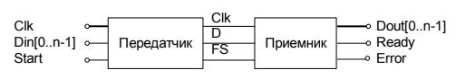

# Цель работы

Познакомиться с принципами организации последовательного обмена в вычислительных системах.

# Задание на лабораторную работу

Работа состоит из двух частей. В первой части выполняется проектиро-
вание и отладка элементов синхронного, а во второй – асинхронного после-
довательного интерфейса. Работа выполняется по следующим этапам.

1. Подготовить исходные файлы для реализации синхронных приемника
  и передатчика в соответствии с заданным вариантом.

2. Разработать проект тестирования приемника и передатчика

  

3. Выполнить моделирование устройств.
4. Выполнить макетирование. Проект должен состоять из приемника и передатчика, не связанных между собой внутри ПЛИС. Данные для передат чика Din формируются на переключателях, сигнал Start, инициирующий передачу данных, подключить к кнопке. Выходные сигналы передатчика D, FS, Clk выводятся на внешние контакты микросхемы, с подключением к разъему общего назначения. Входные сигналы приемника также через внешние контакты микросхемы, соединяются с контактами разъема общего назначения, а выходные сигналы Data и Ready выводятся на светодиоды. Для визуального наблюдения работы канала приема-передачи в процессе макетирования рекомендуется задать частоту Clk=1Гц и дополнительно на индикацию выводить сигналы, соответствующие значениям принимаемых битов. Для демонстрации совместной работы приемника и передатчика необходимо соединить выходы передатчика и входы приемника на разъеме и в процессе макетирования имитировать разрыв соединения для выявления ошибки передачи.

5. Скорректировать описание приемника и передатчика для реализации асинхронной передачи. Выполнить задания пп. 2–4 для спроектированных асинхронных узлов.
6. Разработать проект тестирования приемника и передатчика, при этом для связи между ними будет использована единственная линия D.

# Задание

данные - 8

контроль - нечет

стоп-биты - 2

# Выполнение работы

# Вывод

Познакомились с принципами организации последовательного обмена в вычислительных системах.
