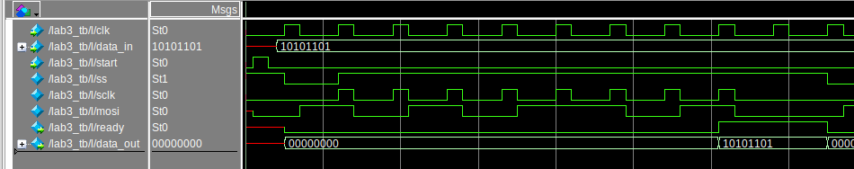
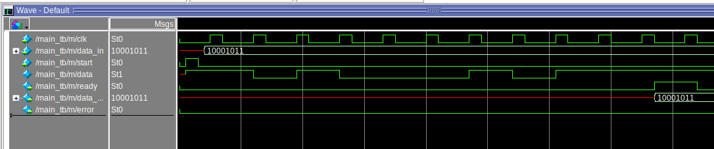

# Цель работы

Познакомиться с принципами организации последовательного обмена в вычислительных системах.

# Задание на лабораторную работу

В первой части выполняется проектирование и отладка элементов синхронного, а во второй –асинхронного последовательного интерфейса. Работа выполняется по следующим этапам.
1. Подготовить исходные файлы для реализации синхронных приемника и передатчика в соответствии с заданным вариантом.
2. Разработать проект тестирования приемника и передатчика.
3. Выполнить моделирование устройств.
4. Выполнить макетирование. Проект должен состоять из приемника и передатчика, не связанных между собой внутри ПЛИС. Данные для передатчика Din формируются на переключателях, сигнал Start, инициирующий передачу данных, подключить к кнопке. Выходные сигналы передатчика D, FS, Clk выводятся на внешние контакты микросхемы, с подключением к разъему общего назначения. Входные сигналы приемника также через внешние контакты микросхемы, соединяются с контактами разъема общего назначения, а выходные сигналы Data и Ready выводятся на светодиоды. Для визуального наблюдения работы канала приема-передачи в процессе макетирования рекомендуется задать частоту Clk=1Гц и дополнительно на индикацию выводить сигналы, соответствующие значениям принимаемых битов. Для демонстрации совместной работы приемника и передатчика необходимо соединить выходы передатчика и входы приемника на разъеме и в процессе макетирования имитировать разрыв соединения для выявления ошибки передачи.
5. Скорректировать описание приемника и передатчика для реализации асинхронной передачи. Выполнить задания пп. 2–4 для спроектированных асинхронных узлов.
6. Разработать проект тестирования приемника и передатчика, при этом для связи между ними будет использована единственная линия D.

# Задание

Асинхронный интерфейс:

- **данные: 8**

- **контроль: нечет**

- **стоп-биты: 2**


# Выполнение работы

## Часть 1. Синхронный интерфейс

**Схема устройства**

ТУТ РИСУНОК

Исходный код устройства:

```verilog
module lab3
(
    input wire clk,
    input wire [7:0] data_in,
    input wire start,
    output wire [7:0] data_out,
    output wire ready
);

wire mosi, sclk, ss;

master m(clk, start, data_in, mosi, sclk, ss);
slave s(sclk, mosi, ss, ready, data_out);

endmodule
```

Передатчик и приемник работают в нулевом режиме, т.е. исходное состояние сигнала синхронизации 0, сдвиг данных происходит по заднему фронту синхросигнала, считывание данных происходит по переднему фронту синхросигнала.

**Устройство передатчика**

Передатчик - операционное устройство, состоящее из управляющего конечного автомата master_ctrl и управляемого сдвигового регистра shift.

Исходный код передатчика:

```verilog
module master
(
    input wire clk, rst,
    input wire [7:0] data_in,
    output wire mosi, sclk, ss
);
    wire shift_en, load;
    
    master_ctrl ctrl(
        .clk(clk),
        .rst(rst),
        .shift_en(shift_en),
        .load(load),
        .sclk(sclk),
        .ss(ss)
    );

    shift shift(
        .clk(clk), 
        .rst(rst), 
        .shift_en(shift_en), 
        .load(load),
        .data_in(data_in), 
        .s_out(mosi)
    );

endmodule

```

**Конечный автомат**

Управляющий конечный автомат имеет 4  состояния: 

- Начальное состояние Init, при котором сбрасываются все управляющие сигналы, линия ss выставлена в 1.
- Состояние Load, в котором подается сигнал на сдвиговый регистр загрузить новый пакет данных, линия ss выставлена в 0.
- Состояние Shift, при котором подается сигнал на сдвиговый регистр сдвинуть данные.
- Состояние Done, при котором управляющее устройство заканчивает передачу данных.

Исходный код конечного автомата:

``` verilog
module master_ctrl
(
    input wire clk, // clock
    input wire rst, // async clear
    output reg shift_en, // shift enable
    output reg load, // load data to shift reg
    output wire sclk, // serial clock
    output reg ss // slave select
);

    // states for FSM
    localparam [1:0]
            Init = 2'b00,
            Load = 2'b01,
            Shift = 2'b10,
            Done = 2'b11;

    reg [1:0] current_state, next_state;
    reg [3:0] count;
    reg clk_en;

    assign sclk = clk_en & clk; // output the clock when needed

    always @(posedge clk or posedge rst)
    begin
        if (rst)
            current_state <= Init;
        else
            current_state <= next_state;
    end

    always @(negedge clk or posedge rst) begin
        if(rst)
            count <= 4'b0000;
        else if (current_state == Load)
            count <= 4'b0000;
        else if (current_state == Shift)
            count <= count + 1'b1;
        else
            count <= 4'b0000;
    end

    // FSM next_state states block and output block
    always @(*)
    begin	
        case (current_state)
                Init : begin
                    {shift_en, load, clk_en, ss} <= 4'b0001;
                    next_state <= Load;
                end

                Load : begin
                    {shift_en, load, clk_en, ss} <= 4'b0100;			 
                    next_state <= Shift;
                end

                Shift : begin
                    {shift_en, load, ss} <= 3'b101;

                    if(count == 4'b1000)
                    begin
                        next_state <= Done;
                        clk_en <= 1'b0;
                    end
                    else
                    begin
                        clk_en <= 1'b1;
                        next_state <= current_state;
                    end
                end

                Done : begin
                    {shift_en, load, clk_en, ss} <= 4'b0001;
                    next_state <= Load;
                end

                default : begin
                    {shift_en, load, clk_en, ss} <= 4'b0001;
                    next_state <= Init;
                end
        endcase
    end

endmodule

```


**Управляемый сдвиговый регистр**

Исходный код сдвигового регистра

```verilog
module shift(
    input wire clk, rst,
    input wire shift_en, load,
    input wire [7:0] data_in,
    output wire s_out
);
    reg [7:0] data;
    assign s_out = data[7];
    
    always @(negedge clk or posedge rst) 
    begin
        if (rst)
            data = 8'b00000000;
        else
        begin
            if(load)
                data = data_in; 
            else if (shift_en)
                data = {data[6:0], 1'b0};
            else
                data = data;
        end
    end

endmodule

```


**Устройство приемника**

Приемник представляет собой сдвиговый регистр, в который загружаются данные, приходящие с передатчика.

Исходный код приемника:

```verilog
module slave
(
    input wire sclk,
    input wire mosi,
    input wire ss,
    output wire ready,
    output wire [7:0] data
);

    reg [7:0] data_out;
    reg [3:0] count;

    assign ready = (count == 4'b1000) ? 1'b1 : 1'b0;
    assign data = (ready == 1'b1) ? data_out : 8'b00000000;
    
    always @(posedge sclk or negedge ss) 
    begin
        if (!ss) begin
            count <= 4'b0000;
            data_out <= 8'b00000000;
        end
        else begin
            count <= count + 1'b1;
            data_out <= {data_out[6:0], mosi};
        end
    end
endmodule
```


Моделирование работы приемника и передатчика представлено на рисунке




## Часть 2. Aсинхронный интерфейс

**Схема устройства**

ТУТ РИСУНОК

Исходный код устройства:

``` verilog
module main
(
    input wire clk,
    input wire [7:0] data_in,
    input wire start,
    output wire [7:0] data_out,
    output wire error,
    output wire ready
);

wire data;

tx t(clk, start, data_in, data);
rx r(clk, data, ready, error, data_out);

endmodule
```


**Устройство передатчика**

Передатчик - операционное устройство, состоящее из управляющего конечного автомата tx_ctrl и управляемого сдвигового регистра tx_shift.

Исходный код передатчика:

``` verilog
module tx
#
(
    parameter DATA_WIDTH = 8
)
(
    input wire clk, rst,
    input wire [DATA_WIDTH - 1 : 0] data_in,
    output wire tx_data
);
    wire shift_en, load;
    wire tx_clk;

    assign tx_clk = clk;

    tx_shift shift(
        .clk(tx_clk), 
        .rst(rst),
        .shift_en(shift_en),
        .load(load),
        .data_in(data_in), 
        .s_out(tx_data)
    );

    tx_ctrl ctrl(
        .clk(clk),
        .rst(rst),
        .shift_en(shift_en),
        .load(load)
    );

endmodule

```


**Конечный автомат**

Управляющий конечный автомат имеет 4  состояния: 

- Начальное состояние Init, при котором сбрасываются все управляющие сигналы.
- Состояние Load, в котором подается сигнал на сдвиговый регистр загрузить новый пакет данных.
- Состояние Shift, при котором подается сигнал на сдвиговый регистр сдвинуть данные.
- Состояние Done, при котором управляющее устройство заканчивает передачу данных.

Исходный код конечного автомата:

``` verilog
module tx_ctrl
(
    input wire clk, // clock
    input wire rst, // async clear
    output reg shift_en, // shift enable
    output reg load // load data to shift reg
);

    // states for FSM
    localparam [1:0]
            Init = 2'b00,
            Load = 2'b01,
            Shift = 2'b10,
            Done = 2'b11;

    reg [1:0] current_state, next_state;
    reg [3:0] count;

    always @(posedge clk or posedge rst)
    begin
        if (rst)
            current_state <= Init;
        else
            current_state <= next_state;
    end

    always @(negedge clk or posedge rst) 
    begin
        if(rst)
            count <= 4'b0000;
        else if (current_state == Shift)
            count <= count + 1;
        else
            count <= 4'b0000;
    end

    // FSM next_state states block and output block
    always @(*)
    begin
        case (current_state)
                Init : begin
                    {shift_en, load} <= 2'b00;
                    next_state <= Load;
                end

                Load : begin
                    {shift_en, load} <= 2'b01;        
                    next_state <= Shift;
                end

                Shift : begin
                    {shift_en, load} <= 2'b10;

                    if(count == 4'b1011)
                        next_state <= Done;
                    else
                        next_state <= current_state;
                end

                Done : begin
                    {shift_en, load} <= 2'b00;
                    next_state <= Load;
                end

                default : begin
                    {shift_en, load} <= 2'b00;
                    next_state <= Init;
                end
        endcase
    end

endmodule

```

**Управляемый сдвиговый регистр**

Исходный код сдвигового регистра

``` verilog
module tx_shift
#
(
	parameter DATA_WIDTH = 8
)
(
    input wire clk, rst,
    input wire shift_en, load,
    input wire [DATA_WIDTH - 1:0] data_in,
    output wire s_out
);
    localparam PACKAGE_WIDTH = 12;
    reg [PACKAGE_WIDTH - 1:0] data;

    assign s_out = data[PACKAGE_WIDTH - 1];
    
    always @(posedge clk or posedge rst) 
    begin
        if (rst)
            data <= 12'b1111_1111_1111;
        else if(load)
            // start_bit, data, parity, stop_bit(s)
            data <= {1'b0, data_in, (~^data_in), 1'b1, 1'b1};
        else if (shift_en)
            data <= {data[PACKAGE_WIDTH - 1:0], 1'b0};
        else
            data <= data;
    end

endmodule

```


**Устройство приемника**:

``` verilog
module rx
(
    input wire clk,
    input wire s_in,
    output wire ready,
    output wire error,
    output wire [7:0] data
);

    localparam
            Init = 1'b0,
            Data = 1'b1;

    reg current_state;
    reg [3:0] count;
    reg [8:0] data_;

    assign ready = (count == 4'b1001) ? 1'b1 : 1'b0;
    assign data = (ready == 1'b1) ? data_[8:1] : data;
    assign error = (ready == 1'b1) ? (((~^data_[8:1]) == data_[0]) ? 1'b0 : 1'b1) : 1'b0;

    always @(negedge clk)
    begin
        case (current_state)
                Init : begin
                    data_ <= 9'b000000000;
                    count <= 4'b0000;

                    if (s_in == 1'b0)
                        current_state <= Data;
                    else
                        current_state <= Init;
                end

                Data : begin
                    data_[4'b1000 - count] <= s_in;

                    if(count == 4'b1001)
                    begin
                        count <= 4'b0000;
                        current_state <= Init;
                    end
                    else
                    begin
                        current_state <= Data;
                        count <= count + 1'b1;
                    end
                end

                default : begin
                    count <= 4'b0000;
                    data_ <= data_;
                    current_state <= Init;
                end
        endcase
    end


endmodule

```


Моделирование работы приемника и передатчика представлено на рисунке




# Вывод

Познакомились с принципами организации последовательного обмена в вычислительных системах.
