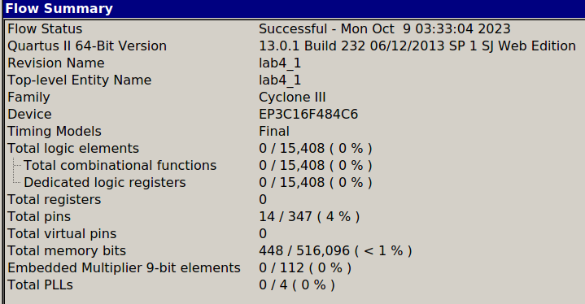
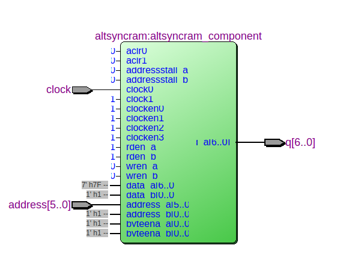
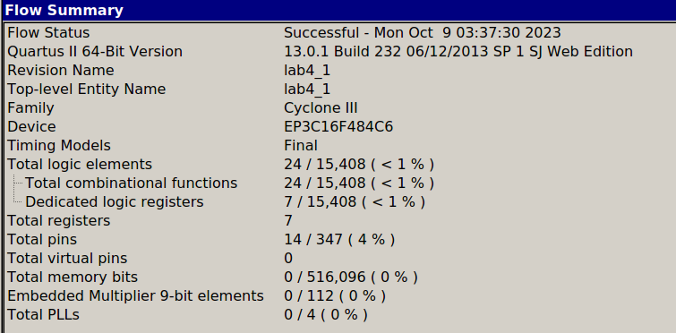
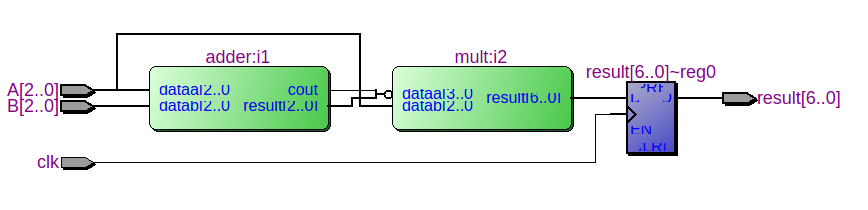
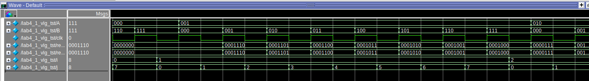

# Цель работы

Изучение способов настройки и использования блоков встроенной памяти ПЛИС при организации адресного и последовательного доступа.

# Задание на лабораторную работу

Работа состоит из двух частей.

В первой части предполагается знакомство с блоком памяти, работающем в режиме доступа по адресу. Требуется реализовать арифметическую функцию двумя способами: табличным с использованием внутрикристальной блочной памяти и логическим в базисе библиотечных элементов и мегафункций САПР Quartus II.

Вторая часть посвящена разработке на базе блочной памяти устройства с последовательным доступом. Требуется разработать устройство междоменной синхронизации. Устройство представляет собой буфер и работает по принципу FIFO. При обращении к нему по записи выполняется запись в первую свободную ячейку, при отсутствии свободных ячеек формируется сигнал «Буфер заполнен». Считывание выполняется из первой занятой ячейки, с последующим сдвигом значений, содержащихся в буфере, на одну позицию. Если все данные из буфера прочитаны, то вырабатывается сигнал «Буфер пуст». Тактирование обращений по чтению и записи осуществляется синхросигналами, отличающимися по частоте.

# Задание

Часть 1. 
$$
\overline{A + B} * A
$$
Часть 2.

***Объем буфера:*** 13

***Изменение адресов при записи:*** ↓

***Тактирование чтения/записи:***  ↑/↓

***Разрядность данных:*** 11

# Выполнение работы

## Часть 1. 

Устройство на основе блока памяти:

```verilog
module lab4_1(
    input wire clk,
    input wire [2:0] A,
    input wire [2:0] B,
    output wire [6:0] result
);

lpm_rom_block mem_func({A, B}, clk, result);

endmodule
```

lpm_rom_block - IP-блок ROM 1-PORT. Подключен файл func.mif, сгенерированный python скриптом, содержащий ответ для входного значения.




Как видно из картинки, при реализации с использованием памяти, не расходуются логические элементы и регистры на кристалле.  


RTL:




Устройство на основе библиотечных элементов:

```verilog
module lab4_1(
    input wire clk,
    input wire [2:0] A,
    input wire [2:0] B,
    output reg [6:0] result
);

wire [3:0] temp;
wire [6:0] temp_result;

adder i1(A, B, temp[3], temp[2:0]);
mult i2(~temp, A, temp_result);

always @(posedge clk)
    result <= temp_result;

endmodule

```

adder - сумматор, mult - умножитель.

Библиотечный элемент памяти реализует считывание с задержкой в 1 такт. Реализация без памяти содержит триггер для реализации такой же задержки.



Как видно из картинки, использовалось 7 регистров, так как выходной сигнал имеет разрядность 7. Так же использовалось 24 логических элемента.


RTL:




Преимущества реализации с памятью:

+ В некоторых случаях проще создать таблицу соответствия, чем реализовывать элементами, например тригонометрические функции.
+ Работает с меньшими задержками, чем реализация на логике, т.к использует специальные элементы памяти на кристалле.
+ Возможность реализации конвейерного вычисления.

- При отсутствии специальных блоков памяти, возможно, будет занимать больше места на кристалле.

Преимущества реализации без памяти:

- В некоторых случаях проще реализовать вычисление логической функции, например самые простые логические функции.
- Не всегда присутствуют элементы памяти на кристалле.


Тестбенч для моделирования: 

```verilog
`timescale 1 ns/ 1 ps
module lab4_1_vlg_tst();
reg [2:0] A;
reg [2:0] B;
reg clk;                                             
wire [6:0] result1;
wire [6:0] result2;

integer i, j;
                     
lab4_1 i1 (
	.A(A),
	.B(B),
	.clk(clk),
	.result1(result1),
	.result2(result2)
);

initial 
begin
    A = 0;
    B = 0;
    clk = 1;
    #10 clk = 0;
    for (i = 0; i < 8; i = i + 1)
    begin
        for (j = 0; j < 8; j = j + 1)
        begin
            #10 clk <= 1;
            A <= i;
            B <= j;
            #10 clk <= 0;
        end
    end
end

endmodule

```


Совместное моделирование:



Значения одинаковы для всех возможных входных данных. Задержка чтения на 1 такт.


## Часть 2. 


# Вывод

Изучили способы настройки и использования блоков встроенной памяти ПЛИС при организации адресного и последовательного доступа.